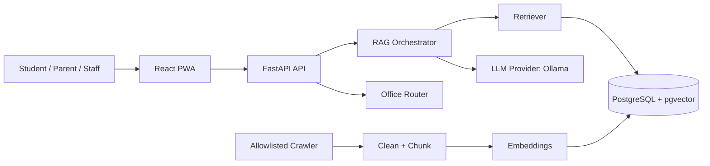

<div align="center">

# UniMate

### Verified, multilingual university AI assistant

Answers in **14 languages** — grounded in official sources, never hallucinated.

[-red.svg)](LICENSE)
[](../../issues)
[](../../commits)


<br/>


</div>

---

## Why UniMate?

Generic chatbots happily invent deadlines and policies. **UniMate refuses to guess.** Every answer is retrieved from official, allowlisted sources and cited. When the sources don't cover a question, UniMate says so and routes the user appropriately instead of fabricating an answer.

- **Source-grounded RAG** — retrieval over official content happens *before* generation; answers carry citations.
- **Truly multilingual** — answers are generated directly in the user's language (auto-detected), across 14 languages.
- **Safe by design** — prompt-injection and sensitive-topic guards, a mandatory "unverified" fallback, and rate limiting.
- **Admin review workflow** — crawled content is held for approval; admins manage sources, FAQs, and analytics.
- **Installable PWA** — works on mobile and desktop, offline-aware.

## Tech stack

| Layer | Stack |
|-------|-------|
| **Frontend** | React 18 · TypeScript · Vite · Tailwind CSS · React Router · TanStack Query · Zustand · react-i18next · PWA |
| **Backend** | Python 3.11 · FastAPI · SQLModel · Pydantic · SlowAPI · Alembic · APScheduler |
| **Data** | PostgreSQL + pgvector (SQLite for local/tests) |
| **AI** | Ollama (default, local) — chat `llama3.2:3b`, embeddings `bge-m3` |

## Architecture



More detail in [`docs/architecture.md`](docs/architecture.md).

## Quick Start

> **Prerequisites:** Node.js 20+, Python 3.11+, and (optional but recommended) [Ollama](https://ollama.com) for local models.

### Windows — one click

```bat
git clone https://github.com/sahaj2310-tech/UniMate.git
cd UniMate
install.bat   :: installs all frontend + backend dependencies
start.bat     :: launches the backend API and the web app
```

### Manual setup (any OS)

```bash
git clone https://github.com/sahaj2310-tech/UniMate.git
cd UniMate
cp .env.example .env

# Frontend (npm workspace)
npm install

# Backend (virtual environment recommended)
python -m venv backend/.venv
backend/.venv/Scripts/activate            # Windows
# source backend/.venv/bin/activate       # macOS / Linux
pip install -r backend/requirements-dev.txt
```

### (Optional) Pull local models

```bash
ollama pull llama3.2:3b
ollama pull bge-m3
```

### Run

```bash
# Terminal 1 — backend API (http://localhost:8000, interactive docs at /docs)
uvicorn app.main:app --reload --app-dir backend

# Terminal 2 — frontend (http://localhost:5173)
npm run dev
```

## Common commands

| Command | What it does |
|---------|--------------|
| `npm run dev` | Start the frontend dev server |
| `npm run build` | Production build (typecheck + Vite) |
| `npm run test:frontend` | Run Vitest |
| `npm run test:backend` | Run Pytest |
| `npm run crawl` | Run the allowlisted crawler |
| `npm run evaluate` | Evaluate RAG quality (release gate) |

Backend formatting/linting (from `backend/`): `ruff check .` and `black .`.
Full operational procedures (DB verification, admin bootstrap, evaluation modes, crawling) live in [`docs/operations.md`](docs/operations.md).

## Documentation

| Doc | Description |
|-----|-------------|
| [Architecture](docs/architecture.md) | System diagram and data flow |
| [API](docs/api.md) | HTTP endpoint reference |
| [Deployment](docs/deployment.md) | Hosting options |
| [Operations](docs/operations.md) | DB verification, evaluation, crawler, admin bootstrap |
| [Ingestion guide](docs/ingestion-guide.md) | Crawling, cleaning, embedding |
| [Security](docs/security.md) | Threat model and safeguards |
| [Contributing](CONTRIBUTING.md) · [Code of Conduct](CODE_OF_CONDUCT.md) · [Security Policy](SECURITY.md) | Project governance |

## Contributing

UniMate is a personal project and is released under a proprietary, no-modification
[license](LICENSE), so pull requests that modify the code can't be merged — but
bug reports, ideas, and feedback are very welcome. See [CONTRIBUTING.md](CONTRIBUTING.md),
the [Code of Conduct](CODE_OF_CONDUCT.md), and, for vulnerabilities, [SECURITY.md](SECURITY.md).

## Author

Designed and built by **Sahaj Sinha**.

## License

This project is released under a custom proprietary **no-modification** license.
You may view and clone it for personal, non-commercial evaluation, but you may
**not** modify, redistribute, or use it commercially without written permission.
See [LICENSE](LICENSE) for the full terms.

<div align="center">
<sub>© 2026 Sahaj Sinha. All Rights Reserved.</sub>
</div>
