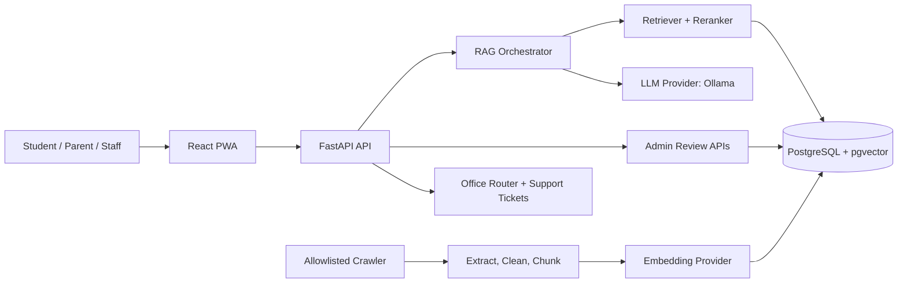

# Architecture

The system is source-grounded by design. Official public pages are crawled only from the allowlist, cleaned, chunked, embedded, and held for approval when required. Chat requests retrieve official chunks before generation. If evidence is weak, the answer falls back to the required unverified message and routes to the best office.

Primary deployment starts with Docker Compose: frontend, backend, PostgreSQL + pgvector, and optional Redis. Hosted and university-controlled alternatives are documented in `deployment.md`.
